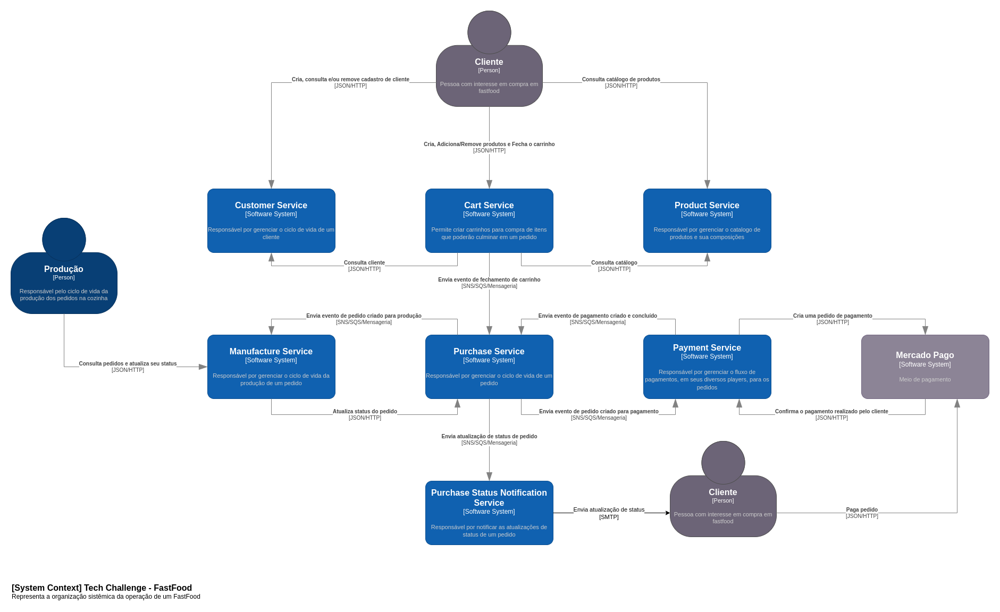
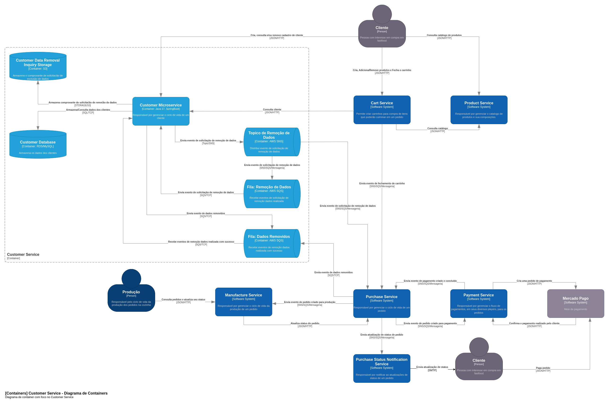
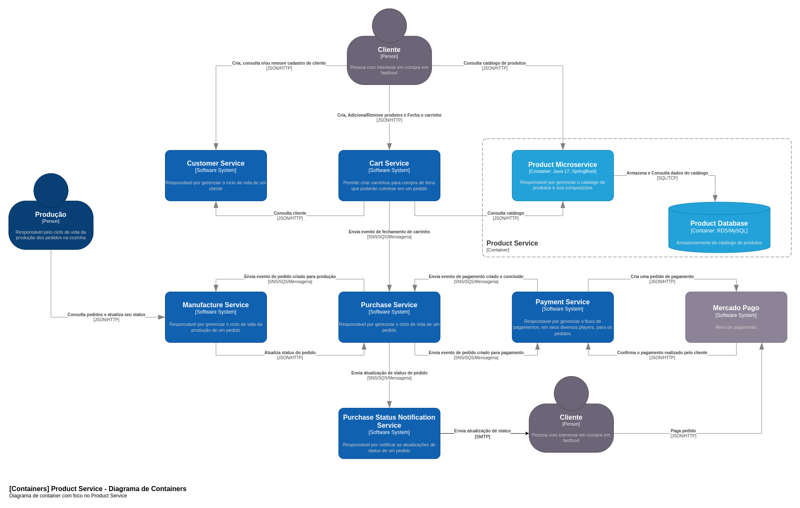
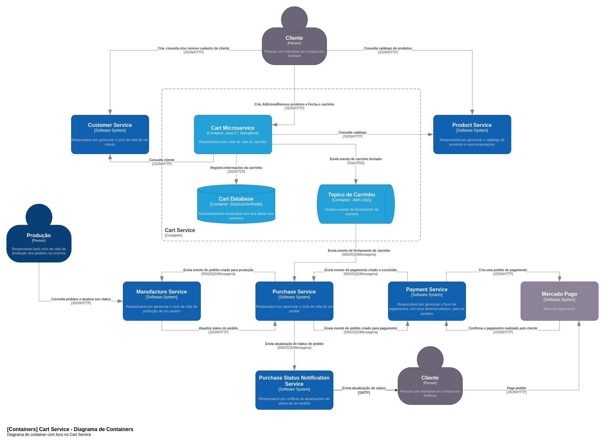
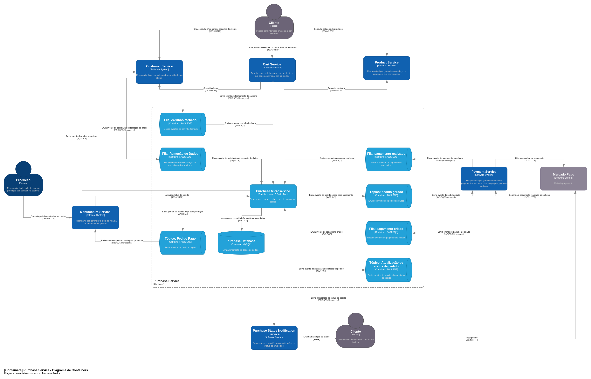
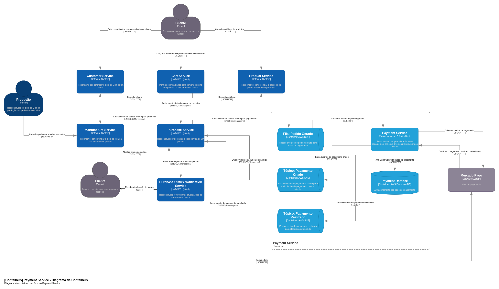
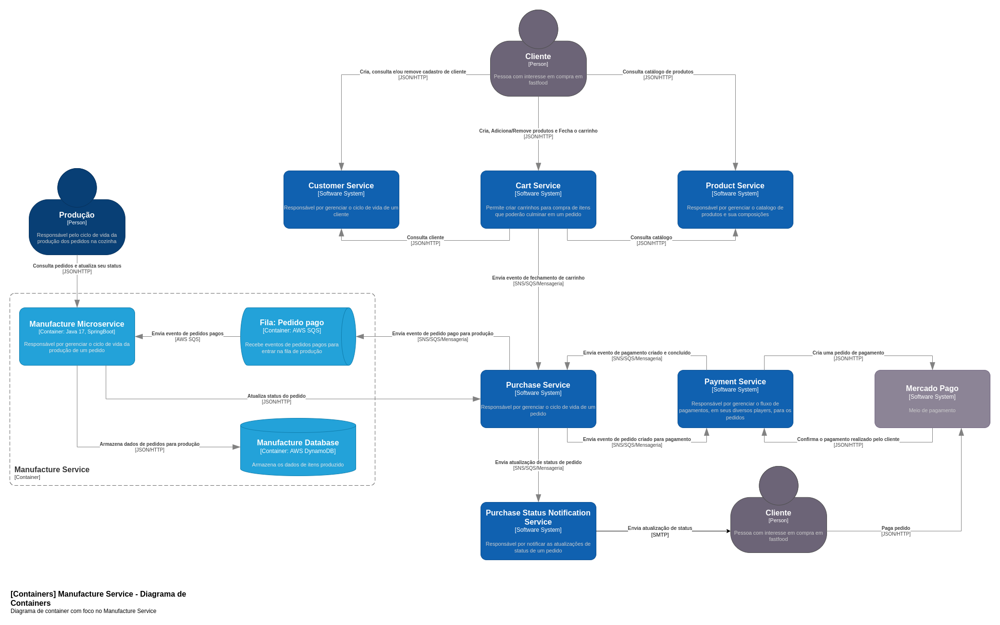
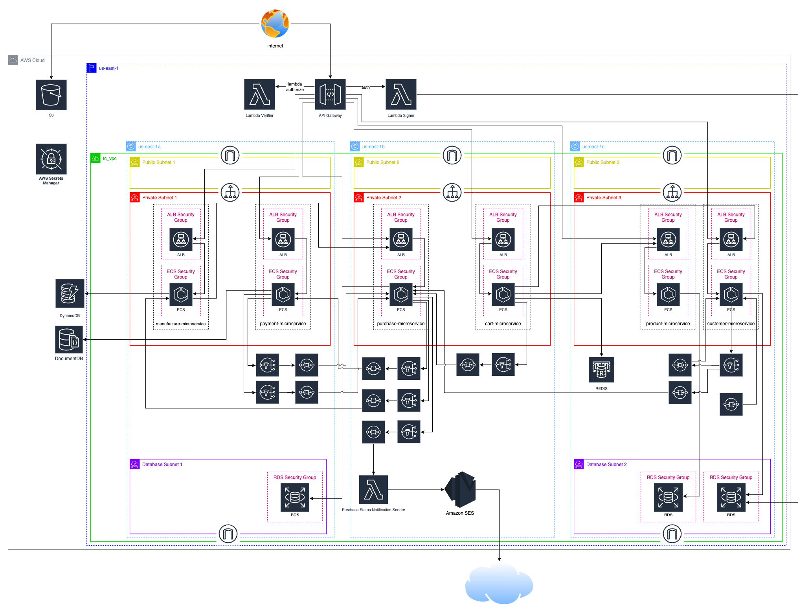

# Tech Chalenge Pos-Tech - Fiap

## Tópicos

- [Tech Chalenge Pos-Tech - Fiap](#tech-chalenge-pos-tech---fiap)
  - [Tópicos](#tópicos)
  - [Problema](#problema)
  - [Descrição do Sistema](#descrição-do-sistema)
  - [Event Storming](#event-storming)
  - [Decisões Arquiteturais](#decisões-arquiteturais)
    - [Padrão Saga](#padrão-saga)
  - [Arquitetura](#arquitetura)
    - [Visão Geral](#visão-geral)
    - [Customer Microservice](#customer-microservice)
    - [Product Microservice](#product-microservice)
    - [Cart Microservice](#cart-microservice)
    - [Purchase Microservice](#purchase-microservice)
    - [Payment Microservice](#payment-microservice)
    - [Manufacture Microservice](#manufacture-microservice)
    - [Arquitetura Cloud](#arquitetura-cloud)
  - [Como executar o projeto? 💻](#como-executar-o-projeto-)
    - [Execução 🏃](#execução-)
  - [Análise de Vulnerabilidades](#análise-de-vulnerabilidades)
  - [LGPD](#lgpd)


## Problema
Há uma lanchonete de bairro que está expandindo devido seu grande sucesso. Porém, com a expansão e sem um sistema de controle de pedidos, o atendimento aos clientes pode ser caótico e confuso. Por exemplo, imagine que um cliente faça um pedido complexo, como um hambúrguer personalizado com ingredientes específicos, acompanhado de batatas fritas e uma bebida. O atendente pode anotar o pedido em um papel e entregá-lo à cozinha, mas não há garantia de que o pedido será preparado corretamente. Sem um sistema de controle de pedidos, pode haver confusão entre os atendentes e a cozinha, resultando em atrasos na preparação e entrega dos pedidos. Os pedidos podem ser perdidos, mal interpretados ou esquecidos, levando à insatisfação dos clientes e a perda de negócios. Em resumo, um sistema de controle de pedidos é essencial para garantir que a lanchonete possa atender os clientes de maneira eficiente, gerenciando seus pedidos e estoques de forma adequada. Sem ele, expandir a lanchonete pode acabar não dando certo, resultando em clientes insatisfeitos e impactando os negócios de forma negativa. Para solucionar o problema, a lanchonete irá investir em um sistema de autoatendimento de fast food, que é composto por uma série de dispositivos e interfaces que permitem aos clientes selecionar e fazer pedidos sem precisar interagir com um atendente.

## Descrição do Sistema
Sistema de gerenciamento de pedidos de fast food, este sistema tem como objetivo permitir que a rede de fast food possa atender os clientes de maneira eficiente, gerenciando seus pedidos e estoques de forma adequada assim viabilizando a expansão da rede. 

## Event Storming

O projeto foi elaborado com base na Arquitetura Hexagonal seguindo os conceitos de DDD, cujo Event Storming pode ser acessado [Aqui](https://miro.com/app/board/uXjVM5IDnUo=/?share_link_id=798761038531).

## Decisões Arquiteturais

### Padrão Saga

Dado que as nossas duas coreografias existentes: no fluxo de criação do pedido / pagamento / liberação para produção; no fluxo de anonimização dos dados dos clientes; envolvem, respectivametne, 3 e 2 serviços, a quantidade de participantes favorece a escolha da saga coreografada. 

Além disso, os serviços já tinham uma comunicação baseada em mensageria. Logo, o custo de implementação é menor.

A partir dessa escolha, evitamos a manutenção em um serviço adicional que seria responsável por orquestrar as sagas e ainda eliminamos o ponto único de falha que essa estratégia proporciona.

Os desenhos de arquitetura que demonstram a coreografia em questão podem ser vistos nos desenhos de arquitetura, abaixo, e no diagrama da construção na cloud.

## Arquitetura

### Visão Geral



### Customer Microservice



[Customer - Repositório do Serviço](https://github.com/fiap-postech/customer-microservice)

### Product Microservice



[Product - Repositório do Serviço](https://github.com/fiap-postech/product-microservice)

### Cart Microservice



[Cart - Repositório do Serviço](https://github.com/fiap-postech/cart-microservice)

### Purchase Microservice



[Purchase - Repositório do Serviço](https://github.com/fiap-postech/purchase-microservice)

### Payment Microservice



[Payment - Repositório do Serviço](https://github.com/fiap-postech/payment-microservice)

### Manufacture Microservice



[Manufacture - Repositório do Serviço](https://github.com/fiap-postech/manufacture-microservice)

### Arquitetura Cloud



## Como executar o projeto? 💻

### Execução 🏃

1. Execute o docker-compose.yml para iniciar o provisionamento da solução
```sh
docker-compose -f docker/docker-compose.yml up -d
```
Ao executar o docker-compose será aprovisionado:
* Database - MySQL 
* Database - MongoDB
* Localstack:
  * SQS
  * SNS
  * DynamoDB
  * S3
* In-Memory Database - Redis
* Microsserviços:
  * Customer
  * Product
  * Cart
  * Purchase
  * Payment
  * Manufacture

 2. Utilize a collection do Postman que se encontra em: [Tech Challenge API.postman_collection](./doc/postman/Tech%20Challenge%20API.postman_collection.json) juntamente com o arquivo de environment: [local.postman_environment](./doc/postman/local.postman_environment.json) para realizar as requisições nos serviços.
 

## Análise de Vulnerabilidades

Foram executadas análise de vulnerabilidade através da ferramenta OWASP ZAP nos seguintes fluxos:

- Listar/exibir cardápio
- Realização do Pedido (Checkout)
- Confirmação de Pagamento (Webhook)

Não foi executada análise no fluxo de Geração de Pagamento, pois ele não foi elaborado para receber acesso HTTP/Rest. A geração do pagamento ocorre dentro da coreografia iniciada no Checkout do Pedido. Essa dispensa, contudo, foi alinhada com os stakeholders (professores).

Assim, segue os relatórios obtidos antes e depois da análise para cada fluxo:

- Listar/exibir cardápio
  - [Relatório Inicial](/doc/owasp/reports/antes/2024-03-14-ZAP-Report-Cardápio.html)
  - [Relatório Após Melhorias](/doc/owasp/reports/depois/2024-03-14-ZAP-Report-Cardápio.html)
- Realização do Pedido (Checkout)
  - [Relatório Inicial](/doc/owasp/reports/antes/2024-03-14-ZAP-Report-Checkout.html)
  - [Relatório Após Melhorias](/doc/owasp/reports/depois/2024-03-14-ZAP-Report-Checkout.html)
- Confirmação de Pagamento (Webhook)
  - [Relatório Inicial](/doc/owasp/reports/antes/2024-03-14-ZAP-Report-Confirmação_Pagamento.html)
  - [Relatório Após Melhorias](/doc/owasp/reports/depois/2024-03-14-ZAP-Report-Confirmação_Pagamento.html)

Para facilitar a visualização do relatório, gerado em HTML, através do Github, sugerimos o uso do plugin [Github Html Preview](https://chromewebstore.google.com/detail/github-html-preview/pmpjligbgooljdpakhophgddmcipglna?pli=1)

## LGPD

Visando atender às normas vigentes sobre LGPD (Lei Geral de Proteção de Dados) foi elaborado o [RIPD (Relatório de Impacto à Proteção de Dados Pessoais)](/doc/lgpd/tech_challenge_ripd.pdf) que atende a operação da Tech Challenge Fast Food.
